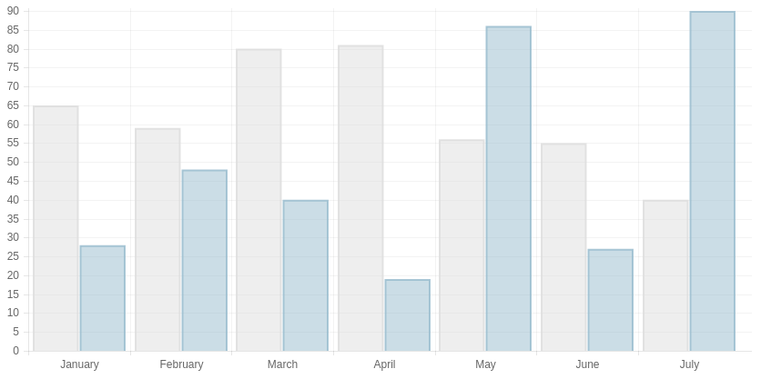
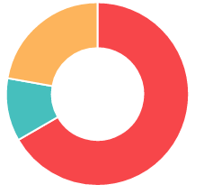
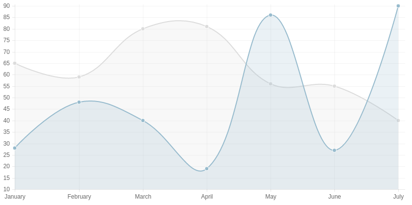
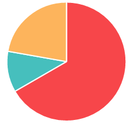
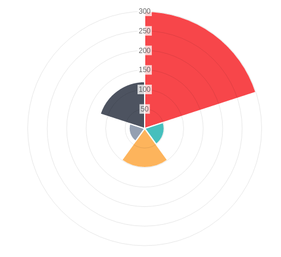
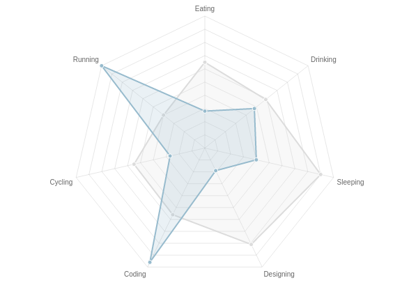

.. py:module:: chartjs

Chart.js - библиотека для построения диаграмм
=============================================

`Официальная страница <http://www.chartjs.org/>`_

Chart
-----

.. py:class:: Chart(context)

    .. code-block:: html

        

        <canvas id="myChart"></canvas>

    .. py:attribute:: defaults.global

        Стандартные настройки для всех видов диаграмм

        .. code-block:: js

            // одиночное изменение парамета
            Chart.defaults.global.animation = false;

            // все параметры
            Chart.defaults.global = {
                // булево - вкл/выкл анимацию
                animation: true,

                // число - количество шагов анимации
                animationSteps: 60,

                // строка - тип анимации
                // linear

                // easeInBack
                // easeInBounce
                // easeInCirc
                // easeInCubic
                // easeInElastic
                // easeInExpo
                // easeInOutElastic
                // easeInOutBack
                // easeInOutBounce
                // easeInOutCirc
                // easeInOutCubic
                // easeInOutExpo
                // easeInOutQuad
                // easeInOutQuart
                // easeInOutQuint
                // easeInOutSine
                // easeInQuad
                // easeInQuart
                // easeInQuint
                // easeInSine

                // easeOutBack
                // easeOutBounce
                // easeOutCirc
                // easeOutCubic
                // easeOutElastic
                // easeOutExpo
                // easeOutQuad
                // easeOutQuart
                // easeOutQuint
                // easeOutSine
                animationEasing: "easeOutQuart",

                // Boolean - If we should show the scale at all
                showScale: true,

                // Boolean - If we want to override with a hard coded scale
                scaleOverride: false,

                // ** Required if scaleOverride is true **
                // Number - The number of steps in a hard coded scale
                scaleSteps: null,
                // Number - The value jump in the hard coded scale
                scaleStepWidth: null,
                // Number - The scale starting value
                scaleStartValue: null,

                // строка - цвет линии
                scaleLineColor: "rgba(0,0,0,.1)",

                // Number - Pixel width of the scale line
                scaleLineWidth: 1,

                // Boolean - Whether to show labels on the scale
                scaleShowLabels: true,

                // Interpolated JS string - can access value
                scaleLabel: "<%=value%>",

                // Boolean - Whether the scale should stick to integers, not floats even if drawing space is there
                scaleIntegersOnly: true,

                // Boolean - Whether the scale should start at zero, or an order of magnitude down from the lowest value
                scaleBeginAtZero: false,

                // String - Scale label font declaration for the scale label
                scaleFontFamily: "'Helvetica Neue', 'Helvetica', 'Arial', sans-serif",

                // Number - Scale label font size in pixels
                scaleFontSize: 12,

                // String - Scale label font weight style
                scaleFontStyle: "normal",

                // строка - цвет заливки
                scaleFontColor: "#666",

                // Boolean - whether or not the chart should be responsive and resize when the browser does.
                responsive: false,

                // Boolean - whether to maintain the starting aspect ratio or not when responsive, if set to false, will take up entire container
                maintainAspectRatio: true,

                // Boolean - Determines whether to draw tooltips on the canvas or not
                showTooltips: true,

                // функция - обработчик вывода подсказки при наведении мышкой на точку диаграммы
                customTooltips: false,
                /*
                 * {
                 *   customTooltips: function(tooltip) {
                 *
                 *       // tooltip will be false if tooltip is not visible or should be hidden
                 *       if (!tooltip) {
                 *           return;
                 *       }
                 *
                 *        // Otherwise, tooltip will be an object with all tooltip properties like:
                 *
                 *       // tooltip.caretHeight
                 *       // tooltip.caretPadding
                 *       // tooltip.chart
                 *       // tooltip.cornerRadius
                 *       // tooltip.fillColor
                 *       // tooltip.font...
                 *       // tooltip.text
                 *       // tooltip.x
                 *       // tooltip.y
                 *       // etc...
                 *
                 *   };
                 */

                // список - список поддерживаемых ивентов
                tooltipEvents: ["mousemove", "touchstart", "touchmove"],

                // String - Tooltip background colour
                tooltipFillColor: "rgba(0,0,0,0.8)",

                // String - Tooltip label font declaration for the scale label
                tooltipFontFamily: "'Helvetica Neue', 'Helvetica', 'Arial', sans-serif",

                // Number - Tooltip label font size in pixels
                tooltipFontSize: 14,

                // String - Tooltip font weight style
                tooltipFontStyle: "normal",

                // String - Tooltip label font colour
                tooltipFontColor: "#fff",

                // String - Tooltip title font declaration for the scale label
                tooltipTitleFontFamily: "'Helvetica Neue', 'Helvetica', 'Arial', sans-serif",

                // Number - Tooltip title font size in pixels
                tooltipTitleFontSize: 14,

                // String - Tooltip title font weight style
                tooltipTitleFontStyle: "bold",

                // String - Tooltip title font colour
                tooltipTitleFontColor: "#fff",

                // Number - pixel width of padding around tooltip text
                tooltipYPadding: 6,

                // Number - pixel width of padding around tooltip text
                tooltipXPadding: 6,

                // Number - Size of the caret on the tooltip
                tooltipCaretSize: 8,

                // Number - Pixel radius of the tooltip border
                tooltipCornerRadius: 6,

                // Number - Pixel offset from point x to tooltip edge
                tooltipXOffset: 10,

                // String - Template string for single tooltips
                tooltipTemplate: "<%if (label){%><%=label%>: <%}%><%= value %>",

                // String - Template string for multiple tooltips
                multiTooltipTemplate: "<%= value %>",

                // Function - Will fire on animation progression.
                onAnimationProgress: function(){},

                // Function - Will fire on animation completion.
                onAnimationComplete: function(){}
            }

    .. py:attribute:: defaults.Bar

        Стандартные настройки для всех диаграмм :py:class:`Chart.Bar`

    .. py:attribute:: defaults.Doughnut

        Стандартные настройки для всех диаграмм :py:class:`Chart.Doughnut`

    .. py:attribute:: defaults.Line

        Стандартные настройки для всех диаграмм :py:class:`Chart.Line`

    .. py:attribute:: defaults.PolarArea

        Стандартные настройки для всех диаграмм :py:class:`Chart.PolarArea`

    .. py:attribute:: defaults.Radar

        Стандартные настройки для всех диаграмм :py:class:`Chart.Radar`

Bar
---

.. py:class:: Chart.Bar()

    Диаграмма

    .. code-block:: js

        var data = {
            labels: ["January", "February", "March", "April", "May", "June", "July"],
            datasets: [
                {
                    label: "My First dataset",
                    fillColor: "rgba(220,220,220,0.5)",
                    strokeColor: "rgba(220,220,220,0.8)",
                    highlightFill: "rgba(220,220,220,0.75)",
                    highlightStroke: "rgba(220,220,220,1)",
                    data: [65, 59, 80, 81, 56, 55, 40]
                },
                {
                    label: "My Second dataset",
                    fillColor: "rgba(151,187,205,0.5)",
                    strokeColor: "rgba(151,187,205,0.8)",
                    highlightFill: "rgba(151,187,205,0.75)",
                    highlightStroke: "rgba(151,187,205,1)",
                    data: [28, 48, 40, 19, 86, 27, 90]
                }
            ]
        };

        var options = {
            //Boolean - Whether the scale should start at zero, or an order of magnitude down from the lowest value
            scaleBeginAtZero : true,

            //Boolean - Whether grid lines are shown across the chart
            scaleShowGridLines : true,

            //String - Colour of the grid lines
            scaleGridLineColor : "rgba(0,0,0,.05)",

            //Number - Width of the grid lines
            scaleGridLineWidth : 1,

            //Boolean - Whether to show horizontal lines (except X axis)
            scaleShowHorizontalLines: true,

            //Boolean - Whether to show vertical lines (except Y axis)
            scaleShowVerticalLines: true,

            //Boolean - If there is a stroke on each bar
            barShowStroke : true,

            //Number - Pixel width of the bar stroke
            barStrokeWidth : 2,

            //Number - Spacing between each of the X value sets
            barValueSpacing : 5,

            //Number - Spacing between data sets within X values
            barDatasetSpacing : 1,

            //String - A legend template
            legendTemplate : "<ul class=\"<%=name.toLowerCase()%>-legend\"><% for (var i=0; i<datasets.length; i++){%><li>\"><%if(datasets[i].label){%><%=datasets[i].label%><%}%></li><%}%></ul>"

        }

        var myBarChart = new Chart(ctx).Bar(data, options);

    .. py:method:: addData(valuesArray, label)

        Добавляет данные в диаграмму, данные также отобразятся визуально.

        .. code-block:: js

            // The values array passed into addData should be one for each dataset in the chart
            myBarChart.addData([40, 60], "August");
            // This new data will now animate at the end of the chart.

    .. py:method:: getBarsAtEvent(event)

        Возвращает данные по ивенту

        .. code-block:: js

            canvas.onclick = function(evt){
                var activeBars = myBarChart.getBarsAtEvent(evt);
                // => activeBars is an array of bars on the canvas that are at the same position as the click event.
            };

    .. py:method:: removeData( )

        Удаляет первый элемент во всех графиках

        .. code-block:: js

            myBarChart.removeData();
            // The chart will remove the first point and animate other points into place

    .. py:method:: update( )

        Перерисовывает диаграмму

        .. code-block:: js

            myBarChart.datasets[0].points[2].value = 50;
            // Would update the first dataset's value of 'March' to be 50
            myBarChart.update();
            // Calling update now animates the position of March from 90 to 50.

Doughnut
--------

.. py:class:: Chart.Doughnut()

    Диаграмма

    .. code-block:: js

        var data = [
            {
                value: 300,
                color:"#F7464A",
                highlight: "#FF5A5E",
                label: "Red"
            },
            {
                value: 50,
                color: "#46BFBD",
                highlight: "#5AD3D1",
                label: "Green"
            },
            {
                value: 100,
                color: "#FDB45C",
                highlight: "#FFC870",
                label: "Yellow"
            }
        ]

        var options = {
            //Boolean - Whether we should show a stroke on each segment
            segmentShowStroke : true,

            //String - The colour of each segment stroke
            segmentStrokeColor : "#fff",

            //Number - The width of each segment stroke
            segmentStrokeWidth : 2,

            //Number - The percentage of the chart that we cut out of the middle
            percentageInnerCutout : 50, // This is 0 for Pie charts

            //Number - Amount of animation steps
            animationSteps : 100,

            //String - Animation easing effect
            animationEasing : "easeOutBounce",

            //Boolean - Whether we animate the rotation of the Doughnut
            animateRotate : true,

            //Boolean - Whether we animate scaling the Doughnut from the centre
            animateScale : false,

            //String - A legend template
            legendTemplate : "<ul class=\"<%=name.toLowerCase()%>-legend\"><% for (var i=0; i<segments.length; i++){%><li>\"><%if(segments[i].label){%><%=segments[i].label%><%}%></li><%}%></ul>"

        }

        var myDoughnutChart = new Chart(ctx[0]).Doughnut(data,options);

    .. py:method:: addData(segmentData, index)

        Добавляет данные в диаграмму, данные также отобразятся визуально.

        .. code-block:: js

            // An object in the same format as the original data source
            myDoughnutChart.addData({
                value: 130,
                color: "#B48EAD",
                highlight: "#C69CBE",
                label: "Purple"
            });
            // The new segment will now animate in.

    .. py:method:: removeData(index)

        Удаляет элемент во всех графиках

        * `index` - удаляемый индекс, необязательный параметр, если не задан то удалится последний сегмент

        .. code-block:: js

            myDoughnutChart.removeData();
            // The chart will remove the first point and animate other points into place

    .. py:method:: update()

        Перерисовывает диаграмму

        .. code-block:: js

            myDoughnutChart.segments[1].value = 10;
            // Would update the first dataset's value of 'Green' to be 10
            myDoughnutChart.update();
            // Calling update now animates the position of Green from 50 to 10.

Line
----

.. py:class:: Chart.Line()

    Диаграмма

    .. code-block:: js

        var data = {
            labels: ["January", "February", "March", "April", "May", "June", "July"],
            datasets: [
                {
                    label: "My First dataset",
                    fillColor: "rgba(220,220,220,0.2)",
                    strokeColor: "rgba(220,220,220,1)",
                    pointColor: "rgba(220,220,220,1)",
                    pointStrokeColor: "#fff",
                    pointHighlightFill: "#fff",
                    pointHighlightStroke: "rgba(220,220,220,1)",
                    data: [65, 59, 80, 81, 56, 55, 40]
                },
                {
                    label: "My Second dataset",
                    fillColor: "rgba(151,187,205,0.2)",
                    strokeColor: "rgba(151,187,205,1)",
                    pointColor: "rgba(151,187,205,1)",
                    pointStrokeColor: "#fff",
                    pointHighlightFill: "#fff",
                    pointHighlightStroke: "rgba(151,187,205,1)",
                    data: [28, 48, 40, 19, 86, 27, 90]
                }
            ]
        };

        var options = {

            ///Boolean - Whether grid lines are shown across the chart
            scaleShowGridLines : true,

            //String - Colour of the grid lines
            scaleGridLineColor : "rgba(0,0,0,.05)",

            //Number - Width of the grid lines
            scaleGridLineWidth : 1,

            //Boolean - Whether to show horizontal lines (except X axis)
            scaleShowHorizontalLines: true,

            //Boolean - Whether to show vertical lines (except Y axis)
            scaleShowVerticalLines: true,

            //Boolean - Whether the line is curved between points
            bezierCurve : true,

            //Number - Tension of the bezier curve between points
            bezierCurveTension : 0.4,

            //Boolean - Whether to show a dot for each point
            pointDot : true,

            //Number - Radius of each point dot in pixels
            pointDotRadius : 4,

            //Number - Pixel width of point dot stroke
            pointDotStrokeWidth : 1,

            //Number - amount extra to add to the radius to cater for hit detection outside the drawn point
            pointHitDetectionRadius : 20,

            //Boolean - Whether to show a stroke for datasets
            datasetStroke : true,

            //Number - Pixel width of dataset stroke
            datasetStrokeWidth : 2,

            //Boolean - Whether to fill the dataset with a colour
            datasetFill : true,

            //String - A legend template
            legendTemplate : "<ul class=\"<%=name.toLowerCase()%>-legend\"><% for (var i=0; i<datasets.length; i++){%><li>\"><%if(datasets[i].label){%><%=datasets[i].label%><%}%></li><%}%></ul>"

        };

        var myLineChart = new Chart(ctx).Line(data, options);

    .. py:method:: addData(valuesArray, label)

        Добавляет данные в диаграмму, данные также отобразятся визуально.

        .. code-block:: js

            // The values array passed into addData should be one for each dataset in the chart
            myLineChart.addData([40, 60], "August");
            // This new data will now animate at the end of the chart.

    .. py:method:: getPointsAtEvent(event)

        Возвращает данные по ивенту

        .. code-block:: js

            canvas.onclick = function(evt){
                var activePoints = myLineChart.getPointsAtEvent(evt);
                // => activePoints is an array of points on the canvas that are at the same position as the click event.
            };

    .. py:method:: removeData( )

        Удаляет первый элемент во всех графиках

        .. code-block:: js

            myLineChart.removeData();
            // The chart will remove the first point and animate other points into place

    .. py:method:: update( )

        Перерисовывает диаграмму

        .. code-block:: js

            myLineChart.datasets[0].points[2].value = 50;
            // Would update the first dataset's value of 'March' to be 50
            myLineChart.update();
            // Calling update now animates the position of March from 90 to 50.

Pie
---

.. py:class:: Chart.Pie()

    Диаграмма

    .. code-block:: js

        var data = [
            {
                value: 300,
                color:"#F7464A",
                highlight: "#FF5A5E",
                label: "Red"
            },
            {
                value: 50,
                color: "#46BFBD",
                highlight: "#5AD3D1",
                label: "Green"
            },
            {
                value: 100,
                color: "#FDB45C",
                highlight: "#FFC870",
                label: "Yellow"
            }
        ]

        var options = {
            //Boolean - Whether we should show a stroke on each segment
            segmentShowStroke : true,

            //String - The colour of each segment stroke
            segmentStrokeColor : "#fff",

            //Number - The width of each segment stroke
            segmentStrokeWidth : 2,

            //Number - The percentage of the chart that we cut out of the middle
            percentageInnerCutout : 50, // This is 0 for Pie charts

            //Number - Amount of animation steps
            animationSteps : 100,

            //String - Animation easing effect
            animationEasing : "easeOutBounce",

            //Boolean - Whether we animate the rotation of the Doughnut
            animateRotate : true,

            //Boolean - Whether we animate scaling the Doughnut from the centre
            animateScale : false,

            //String - A legend template
            legendTemplate : "<ul class=\"<%=name.toLowerCase()%>-legend\"><% for (var i=0; i<segments.length; i++){%><li>\"><%if(segments[i].label){%><%=segments[i].label%><%}%></li><%}%></ul>"

        }

        var myPieChart = new Chart(ctx[0]).Pie(data,options);

    .. py:method:: addData(segmentData, index)

        Добавляет данные в диаграмму, данные также отобразятся визуально.

        .. code-block:: js

            // An object in the same format as the original data source
            myPieChart.addData({
                value: 130,
                color: "#B48EAD",
                highlight: "#C69CBE",
                label: "Purple"
            });
            // The new segment will now animate in.

    .. py:method:: removeData(index)

        Удаляет элемент во всех графиках

        * `index` - удаляемый индекс, необязательный параметр, если не задан то удалится последний сегмент

        .. code-block:: js

            myPieChart.removeData();
            // The chart will remove the first point and animate other points into place

    .. py:method:: update()

        Перерисовывает диаграмму

        .. code-block:: js

            myPieChart.segments[1].value = 10;
            // Would update the first dataset's value of 'Green' to be 10
            myPieChart.update();
            // Calling update now animates the position of Green from 50 to 10.

PolarArea
---------

.. py:class:: Chart.PolarArea()

    Диаграмма создается используя :js:func:`PolarArea`

    .. code-block:: js

        var data = [
            {
                value: 300,
                color:"#F7464A",
                highlight: "#FF5A5E",
                label: "Red"
            }, {
                value: 50,
                color: "#46BFBD",
                highlight: "#5AD3D1",
                label: "Green"
            }, {
                value: 100,
                color: "#FDB45C",
                highlight: "#FFC870",
                label: "Yellow"
            }, {
                value: 40,
                color: "#949FB1",
                highlight: "#A8B3C5",
                label: "Grey"
            }, {
                value: 120,
                color: "#4D5360",
                highlight: "#616774",
                label: "Dark Grey"
            }
        ];

        var options = {
            //Boolean - Show a backdrop to the scale label
            scaleShowLabelBackdrop : true,

            //String - The colour of the label backdrop
            scaleBackdropColor : "rgba(255,255,255,0.75)",

            // Boolean - Whether the scale should begin at zero
            scaleBeginAtZero : true,

            //Number - The backdrop padding above & below the label in pixels
            scaleBackdropPaddingY : 2,

            //Number - The backdrop padding to the side of the label in pixels
            scaleBackdropPaddingX : 2,

            //Boolean - Show line for each value in the scale
            scaleShowLine : true,

            //Boolean - Stroke a line around each segment in the chart
            segmentShowStroke : true,

            //String - The colour of the stroke on each segement.
            segmentStrokeColor : "#fff",

            //Number - The width of the stroke value in pixels
            segmentStrokeWidth : 2,

            //Number - Amount of animation steps
            animationSteps : 100,

            //String - Animation easing effect.
            animationEasing : "easeOutBounce",

            //Boolean - Whether to animate the rotation of the chart
            animateRotate : true,

            //Boolean - Whether to animate scaling the chart from the centre
            animateScale : false,

            //String - A legend template
            legendTemplate : "<ul class=\"<%=name.toLowerCase()%>-legend\"><% for (var i=0; i<segments.length; i++){%><li>\"><%if(segments[i].label){%><%=segments[i].label%><%}%></li><%}%></ul>"

        }

        var myPolarArea = new Chart(ctx).PolarArea(data, options);

    .. py:method:: addData(segmentData, index)

        Добавляет данные в диаграмму, данные также отобразятся визуально.

        .. code-block:: js

            // An object in the same format as the original data source
            myPolarAreaChart.addData({
                value: 130,
                color: "#B48EAD",
                highlight: "#C69CBE",
                label: "Purple"
            });
            // The new segment will now animate in.

    .. py:method:: getSegmentsAtEvent(event)

        Возвращает данные по ивенту

        .. code-block:: js

            canvas.onclick = function(evt){
                var activePoints = myPolarAreaChart.getSegmentsAtEvent(evt);
                // => activePoints is an array of segments on the canvas that are at the same position as the click event.
            };

    .. py:method:: removeData(index)

        Удаляет элемент во всех графиках

        * `index` - удаляемый индекс, необязательный параметр, если не задан то удалится последний сегмент

        .. code-block:: js

            myRadarChart.removeData();
            // The chart will remove the first point and animate other points into place

    .. py:method:: update()

        Перерисовывает диаграмму

        .. code-block:: js

            myPolarAreaChart.segments[1].value = 10;
            // Would update the first dataset's value of 'Green' to be 10
            myPolarAreaChart.update();
            // Calling update now animates the position of Green from 50 to 10.

Radar
-----

.. py:class:: Chart.Radar()

    Диаграмма

    .. code-block:: js

        var data = {
            labels: ["Eating", "Drinking", "Sleeping", "Designing", "Coding", "Cycling", "Running"],
            datasets: [
                {
                    label: "My First dataset",
                    fillColor: "rgba(220,220,220,0.2)",
                    strokeColor: "rgba(220,220,220,1)",
                    pointColor: "rgba(220,220,220,1)",
                    pointStrokeColor: "#fff",
                    pointHighlightFill: "#fff",
                    pointHighlightStroke: "rgba(220,220,220,1)",
                    data: [65, 59, 90, 81, 56, 55, 40]
                },
                {
                    label: "My Second dataset",
                    fillColor: "rgba(151,187,205,0.2)",
                    strokeColor: "rgba(151,187,205,1)",
                    pointColor: "rgba(151,187,205,1)",
                    pointStrokeColor: "#fff",
                    pointHighlightFill: "#fff",
                    pointHighlightStroke: "rgba(151,187,205,1)",
                    data: [28, 48, 40, 19, 96, 27, 100]
                }
            ]
        };

        var options = {
            //Boolean - Whether to show lines for each scale point
            scaleShowLine : true,

            //Boolean - Whether we show the angle lines out of the radar
            angleShowLineOut : true,

            //Boolean - Whether to show labels on the scale
            scaleShowLabels : false,

            // Boolean - Whether the scale should begin at zero
            scaleBeginAtZero : true,

            //String - Colour of the angle line
            angleLineColor : "rgba(0,0,0,.1)",

            //Number - Pixel width of the angle line
            angleLineWidth : 1,

            //String - Point label font declaration
            pointLabelFontFamily : "'Arial'",

            //String - Point label font weight
            pointLabelFontStyle : "normal",

            //Number - Point label font size in pixels
            pointLabelFontSize : 10,

            //String - Point label font colour
            pointLabelFontColor : "#666",

            //Boolean - Whether to show a dot for each point
            pointDot : true,

            //Number - Radius of each point dot in pixels
            pointDotRadius : 3,

            //Number - Pixel width of point dot stroke
            pointDotStrokeWidth : 1,

            //Number - amount extra to add to the radius to cater for hit detection outside the drawn point
            pointHitDetectionRadius : 20,

            //Boolean - Whether to show a stroke for datasets
            datasetStroke : true,

            //Number - Pixel width of dataset stroke
            datasetStrokeWidth : 2,

            //Boolean - Whether to fill the dataset with a colour
            datasetFill : true,

            //String - A legend template
            legendTemplate : "<ul class=\"<%=name.toLowerCase()%>-legend\"><% for (var i=0; i<datasets.length; i++){%><li>\"><%if(datasets[i].label){%><%=datasets[i].label%><%}%></li><%}%></ul>"

        }

        var myRadarChart = new Chart(ctx).Radar(data, options);

    .. py:method:: addData(valuesArray, label)

        Добавляет данные в диаграмму, данные также отобразятся визуально.

        .. code-block:: js

            // The values array passed into addData should be one for each dataset in the chart
            myRadarChart.addData([40, 60], "August");
            // This new data will now animate at the end of the chart.

    .. py:method:: getPointsAtEvent(event)

        Возвращает данные по ивенту

        .. code-block:: js

            canvas.onclick = function(evt){
                var activePoints = myRadarChart.getPointsAtEvent(evt);
                // => activePoints is an array of points on the canvas that are at the same position as the click event.
            };

    .. py:method:: removeData( )

        Удаляет первый элемент во всех графиках

        .. code-block:: js

            myRadarChart.removeData();
            // The chart will remove the first point and animate other points into place

    .. py:method:: update( )

        Перерисовывает диаграмму

        .. code-block:: js

            myRadarChart.datasets[0].points[2].value = 50;
            // Would update the first dataset's value of 'March' to be 50
            myRadarChart.update();
            // Calling update now animates the position of March from 90 to 50.

Базовые методы прототипов всех диаграмм
---------------------------------------

.. py:method:: clear()

    Очищает канвас

.. py:method:: destroy()

    Удаляет диаграмму

.. py:method:: generateLegend()

    Возвращает HTML, сгенерированная легенда для диаграммы

    .. code-block:: js

        document.getElementById("legendDiv").innerHTML = myLineChart.generateLegend();

.. py:method:: resize()

    Изменяет размер канваса

.. py:method:: stop()

    Останавливает анимацию

.. py:method:: toBase64Image()

    Возвращает изображение диаграммы, закодированное в base 64

Добавление новых типов диаграмм
-------------------------------

.. code-block:: js

    Chart.Type.extend({
        // Passing in a name registers this chart in the Chart namespace
        name: "Scatter",
        // Providing a defaults will also register the deafults in the chart namespace
        defaults : {
            options: "Here",
            available: "at this.options"
        },
        // Initialize is fired when the chart is initialized - Data is passed in as a parameter
        // Config is automatically merged by the core of Chart.js, and is available at this.options
        initialize:  function(data){
            this.chart.ctx // The drawing context for this chart
            this.chart.canvas // the canvas node for this chart
        },
        // Used to draw something on the canvas
        draw: function() {
        }
    });

    // Now we can create a new instance of our chart, using the Chart.js API
    new Chart(ctx).Scatter(data);
    // initialize is now run

Расширение существующих диаграмм
--------------------------------

.. code-block:: js

    // Notice now we're extending the particular Line chart type, rather than the base class.
    Chart.types.Line.extend({
        // Passing in a name registers this chart in the Chart namespace in the same way
        name: "LineAlt",
        initialize: function(data){
            console.log('My Line chart extension');
            Chart.types.Line.prototype.initialize.apply(this, arguments);
        }
    });

    // Creates a line chart in the same way
    new Chart(ctx).LineAlt(data);
    // but this logs 'My Line chart extension' in the console.