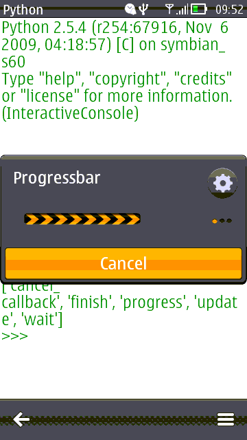

.. py:module:: progressnotes

progressnotes
=============

Модуль создает окнко с прогрессбаром. 

.. py:class:: ProgressNote()

    >>> note = progressnotes.ProgressNote()

.. py:method:: ProgressNote.cancel_callback(callback) 
    
    Функция принимает аргументом функцию, которая выполнится при нажатии кнопки 'Отмена'
    
    >>> def cancel():
            print "cancel"
    >>> note.cancel_callback(cancel)

.. py:method:: ProgressNote.finish() 
    
    Завершает запущенный прогрессбар
    
    >>> note.wait()
    >>> e32.ao_sleep(3)
    >>> note.finish()

.. py:method:: ProgressNote.progress(count) 

    Устанавливает количество пунктов в прогессбаре
    
    >>> note.progress(10)
    >>> for i in range(10):
            note.update(i, u'Обновление')
            e32.ao_sleep(2)
    >>> note.finish()

.. py:method:: ProgressNote.update(count, text) 
    
    Обновляет прогрессбар
    
    >>> note.update(0, u'Подождите')

.. py:method:: ProgressNote.wait() 
    
    Запускает прогрессбар
    
    >>> note.wait()

